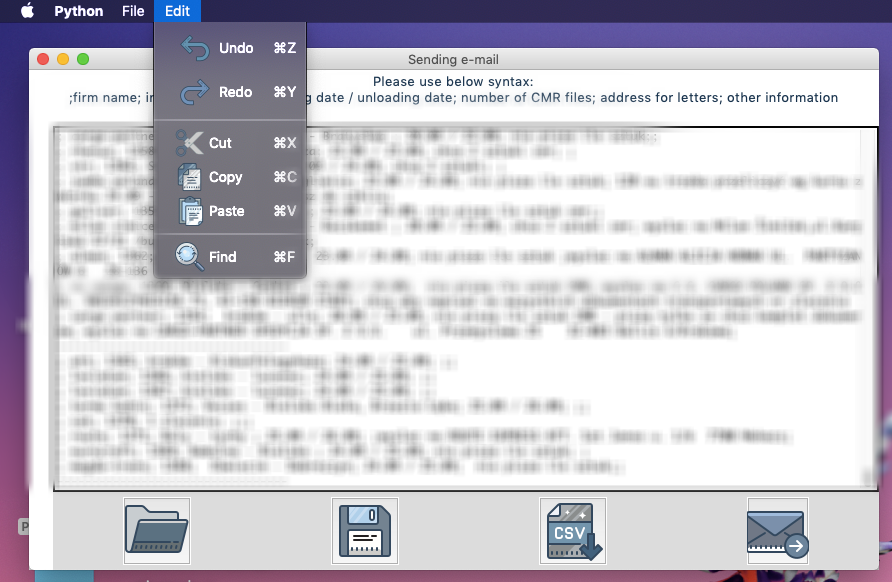

# Sending e-mails app
#### Dedicated app sending e-mails with formatted body and special attachments.

## Table of contents:
#### * General info
#### * Technologies 
#### * Setup
#### * Status

## **General info**:
The main goal of this app is reducing time spent on sending specific e-mails during my working in small family's company. Thanks to it I made up a 15 minutes every day and decreased probability of making mistakes.

The app looks like a notepad with a crucial tool kit and set of necesseries buttons.
The main functions are:
* uploading archival .txt file (required for updating data)
* overwriting this file
* exporting newly part of uploaded .txt file into .csv 
* sending e-mail with: 
     - weekday-related title
     - formatted body using different colors depending on content of exported .csv file
     - attached particular attachments. After sending them the app moves sent attachments to a local archive directory.
     
Additionally, the app shows warning boxes in cases like exiting without saving or overwriting file.
     
## **Technologies**:
Python 3.7.4

### Libraries and packages which have been used:
 - os
 - encodings
 - smtplib
 - calendar
 - fnmatch
 - shutil
 - email
 - datetime
 - **csv**
 - **PIL**
 - **pandas**
 - **tkinter** (as only GUI framework)
 
 ## **Setup**:
 macOS 10.14.6
 
 As I mentioned in "General info" section, this app fulfills very specific requirements. However, in case of desire to solve similar problems please follow below steps:
 
 The app uses desktop paths, file names or email addresses. Please change them in the code. 
 
 Then go on to the following part:
 1. After running the app the notepad window will appear.
 2. Open archival .txt file by clicking on first on the left button. Now we can see the most current archival version of this file. 
 3. Go down to the end of the file and write new data into notepad bearing in mind proper syntax (cf. begining of file).
 4. Overwrite the notepad by clicking on second on the left button or choosing appropriate icon in "File" menubar.
 5. Export file to CSV by clicking on third on the left button or choosing appropriate icon in "File" menubar. The default name of file will appear - the only thing to do is clicking "Save".
 6. Send e-mail by clicking on the last button. 

That's all ;)
